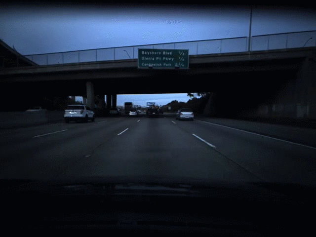

# RAFT

Cool way to calculate optical flow for two images very easily.

Seems to be very good: [Optical Flow Estimation Benchmark](https://paperswithcode.com/sota/optical-flow-estimation-on-sintel-clean)




**Paper:** [RAFT: Recurrent All Pairs Field Transforms for Optical Flow](https://arxiv.org/pdf/2003.12039)

**OG Repo:** [princeton-vl/RAFT](https://github.com/princeton-vl/RAFT)
**OG Repo:** https://github.com/shafu0x/opical-flow-estimation-with-RAFT


## Requirements
```Shell
pip3 install -r requirements.txt
```
